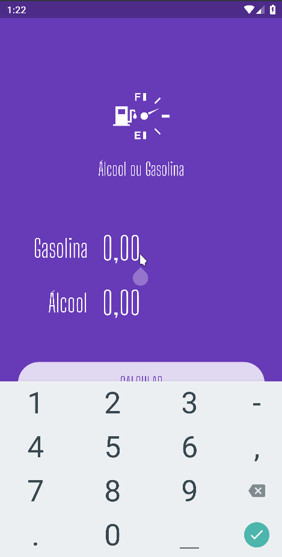

<div align="center" >
  
</div>
<h1 align="center" >
    Preço do Combustível
</h1>

<h4 align="center">
  Descubra qual combustível compensa abastecer seu veículo: gasolina ou álcool!
</h4>
<div align="center" >
  
</div>

<p align="center">
  <a href="#large_blue_diamond-sobre">Sobre</a>&nbsp;&nbsp;&nbsp;|&nbsp;&nbsp;&nbsp;
  <a href="#large_blue_diamond-conteudo-estudado">Conteúdo estudado</a>&nbsp;&nbsp;&nbsp;|&nbsp;&nbsp;&nbsp;
  <a href="#large_blue_diamond-tecnologias">Tecnologias</a>&nbsp;&nbsp;&nbsp;|&nbsp;&nbsp;&nbsp;
  <a href="#large_blue_diamond-como-utilizar">Como instalar</a>&nbsp;&nbsp;&nbsp;|&nbsp;&nbsp;&nbsp;
  <a href="#large_blue_diamond-licenca">Licença</a>
</p>
<br>

## :large_blue_diamond: Sobre

A ideia da aplicação é mostrar para o usuário, após a inserção dos preços de gasolina e álcool, qual o combustível que compensa abastecer.

Este projeto foi desenvolvido no curso Fluter Apps: Álcool ou Gasolina, do [Balta.io](https://balta.io/).

## :large_blue_diamond: Conteudo estudado

Neste projeto de estudo foram vistos os seguintes conteúdos:

- Criação de widgets e inteface com flutter
- Organização e componentização de widgets
- Márcaras e formulários simples
- Animação com cores
- Organizar assets: utilizar fontes e imagens
- Gerenciar estados (programação reativa)

## :large_blue_diamond: Tecnologias

Este projeto foi desenvolvido com as seguintes tecnologias

- [Flutter](https://flutter.dev/)
- [Flutter Masked Text](https://github.com/benhurott/flutter-masked-text)
- [VS Code][vc]

## :large_blue_diamond: Como utilizar

Para rodar a aplicação você precisa ter o Git [Git](https://git-scm.com) e [Flutter] na sua máquina. Você precisará também de um emulador para Android ou IOS.
Como sugestão, utilize o emulador Android do [Android Studio](https://developer.android.com/studio) ou o [Genymotion](https://www.genymotion.com/).

Abra seu emulador e siga os comandos abaixo em seu terminal:

```bash
# Clone this repository
$ git clone https://github.com/agnaldoburgojr/fuel-price-app fuelPrice

# Go into the repository
$ cd fuelPrice

# Run the app
$ flutter run
```

## :large_blue_diamond: Licença

Este projeto possui Licença MIT. Olhe [LICENSE](https://github.com/agnaldoburgojr/fuel-price-app/blob/master/LICENCE) para mais informações.

---

Feito com ♥ por Agnaldo Burgo Junior :wave: [Get in touch!](https://www.linkedin.com/in/agnaldo-burgo-junior/)

[vc]: https://code.visualstudio.com/
